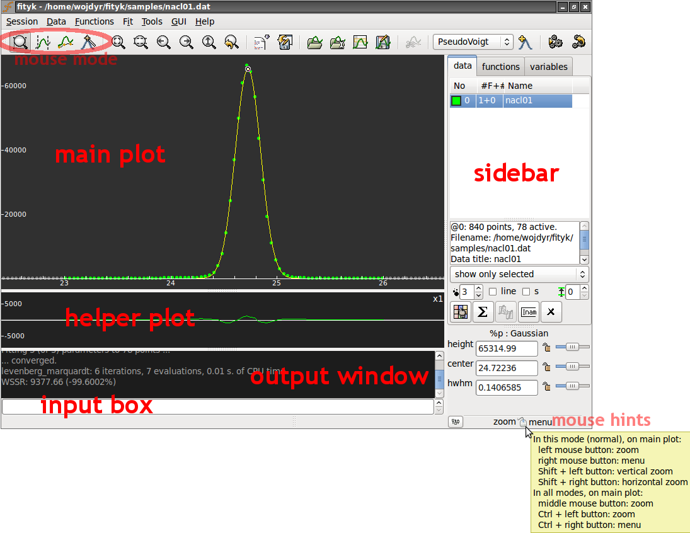

.. _getstarted:

Getting Started
###############

Graphical Interface
===================

That's how the :abbr:`GUI (Graphical User Interface)` looks like:

The **main plot** can display data points, model that is to be fitted to the
data and individual functions in the model. You can configure what is displayed
and how (through :menuselection:`GUI --> Configure` or context menu).

The **helper plot** shows how well the model fits the data.
You may have one, two or no helper plots (:menuselection:`GUI --> Show`).
By default, the plot shows the difference between the data and the model.
It can also show weighted or cumulative difference, and a couple of other things.

The helper plot is also handy for zooming -- with left and middle
mouse buttons. Selecting a horizontal span with the left button
zooms into this span. The middle button goes back to the whole dataset
(the same as |zoom-all-icon| in the toolbar).

The **sidebar** is for switching between datasets, inspecting functions,
and for changing function parameters. It also provides quick access
to a few properties of the main plot, such as the size of data points.

On the main plot, the meaning of the left and right mouse button depends
on the current **mouse mode**. Mouse modes are switched using toolbar
buttons:

* |mode-zoom-icon| *normal mode* -- the left button zooms in and
  the right button shows pop-up menu,

* |mode-range-icon| *data-range mode* -- for activating and de-activating data,
  i.e. for selecting regions of interest,

* |mode-bg-icon| *baseline mode* -- manual baseline subtraction
  (you may never need it),

* |mode-add-icon| *add-peak mode* -- for placing peaks and other functions.

.. |mode-range-icon| image:: img/mode_range_icon.png
   :alt: Data-Range Mode
   :class: icon

.. |mode-bg-icon| image:: img/mode_bg_icon.png
   :alt: Baseline Mode
   :class: icon

The status bar shows a hint of what the mouse does in the current mode.

Finally, the **input field** and the **output window** provide alternative,
console-like way of interacting with the program.
Also, the GUI operations that change the state of the program
(data, model, non-visual settings) are translated into textual commands
and printed in the output window.

.. note:: To save configuration of the GUI (visible windows, colors, etc.)
          for next session use :menuselection:`GUI --> Save current config`.

Minimal Example
===============

Let us analyze a diffraction pattern of NaCl. Our goal is to determine
the position of the center of the highest peak. It is needed for
calculating the pressure under which the sample was measured, but this
later detail in the processing is irrelevant for the time being.

The data file used in this example is distributed with the program and
can be found in the :file:`samples` directory.

.. role:: cli-title

Textual commands that correspond to performed operations are shown
in this section in :cli-title:`CLI` boxes.

First load data from the :file:`nacl01.dat` file.
Select :menuselection:`Data --> Load File`
from the menu (or |load-data-icon| from the toolbar) and choose the file.

.. |load-data-icon| image:: img/load_data_icon.png
   :alt: Load Data
   :class: icon

.. admonition:: CLI

   @0 < nacl01.dat 

You can zoom-in to the biggest peak using the left mouse
button on the residual (helper) plot.
To zoom out, press |zoom-all-icon| on the toolbar.

Now all data points are active. Only the biggest peak is of
our interest, so we want to deactivate the remaining points.
Change to the *range mode* (toolbar: |mode-range-icon|)
and deactivate not needed points with the right mouse button.

.. admonition:: CLI

   A = (x > 23.0 and x < 26.0)

As our example data has no background to worry about, our next step is
to define a peak with reasonable initial values and fit it to the data.
We will use Gaussian.
To see its formula, type: ``info Gaussian`` (or ``i Gaussian``) or look for it
in the section :ref:`flist`.

Select :guilabel:`Gaussian` from the list of functions on the toolbar
and press |add-peak-icon|.

.. admonition:: CLI

   guess Gaussian

Automatic peak detection works in this case, but if it wouldn't, you may
set the initial peak position, height and width manually.
Either with the mouse in the *add-peak mode*, or with a command.

.. admonition:: CLI

   F += Gaussian(~60000, ~24.6, ~0.2)

Parameters of an existing function can be changed in the sideber,
or by dragging that little circle handle attached to each function
(you should see a handle at the top of your Gaussian).

If the peaks/functions are not named explicitely (like in this example),
they get automatic names ``%_1``, ``%_2``, etc.

Now let us fit the function.
Select :menuselection:`Fit --> Run` from the menu or press |fit-icon|.

.. admonition:: CLI

   fit

.. important::

    Fitting minimizes the **weighted** sum of squared residuals
    (see :ref:`nonlinear`).
    The default :ref:`weights of points <weights>` are not equal.

Now you can check the peak position together with other parameters
on the sidebar.
Alternatively, right click the peak handle
and select :menuselection:`Show Info` from the context menu.

.. admonition:: CLI

   info prop %_1

That's it!

By the way, you can save all the issued commands to a file
(:menuselection:`Session --> Save History`)

.. admonition:: CLI

   info history > myscript.fit

and later use it as a macro (:menuselection:`Session --> Execute script`).

.. admonition:: CLI

   exec myscript.fit

.. _cli:

Command Line
============

Fityk comes with a small domain-specific language (DSL).
All operations in Fityk are driven by commands of this language.
Commands can be typed in the input box in the GUI, but if all you want
to do is to type commands, the program has a separate CLI version (cfityk)
for this.

.. admonition:: Do not worry

   you do not need to learn these commands.
   It is possible to use menus and dialogs in the GUI
   and completely avoid typing commands.

When you use the GUI and perform an action using the menu,
you can see the corresponding command in the output window.
Fityk has less than 30 commands. Each performs a single actions,
such as loading data from file, adding function, assigning variable,
fitting, or writing results to a file.

A sequence of commands written down in a file makes a script (macro),
which can automate common tasks. Complex tasks may need to be programmed
in a general-purpose language. That is why Fityk has an embedded Lua interpreter
(Lua is a lightweight programming language).
It is also possible to use Fityk library from a program in Python, C, C++,
Java, Ruby or Perl, and possibly from other languages supported by SWIG.

Now a quick glimpse at the syntax. The ``=->`` prompt below marks an input::

  =-> print pi
  3.14159
  =-> # this is a comment -- from `#' to the end of line
  =-> p '2+3=', 2+3  # p stands for print
  2+3 = 5
  =-> set numeric_format='%.9f'  # show 9 digits after dot
  =-> pr pi, pi^2, pi^3  # pr, pri and prin also stand for print
  3.141592654 9.869604401 31.006276680

Usually, one line has one command, but if it is really needed,
two or more commands can be put in one line::

  =-> $a = 3; $b = 5  # two commands separated with `;'

or a backslash can be used to continue a command in the next line::

  =-> print \
  ... 'this'
  this

If you want to work with multiple datasets simultaneously, you can refer to
a dataset through its number: the first dataset is ``@0``, the second -- ``@1``,
etc::

  =-> fit # perform fitting of the default dataset (the first one)
  =-> @2: fit # fit the third dataset (@2)
  =-> @2 @3: fit # fit the third dataset (@2) and then the fourth one (@3)
  =-> @*: fit # fit all datasets, one by one

Settings in the program are changed with the command ``set``::

  set key = value

For example::

  =-> set logfile = 'C:\log.fit' # log all commands to this file
  =-> set verbosity = 1 # make output from the program more verbose
  =-> set epsilon = 1e-14

The last example changes the *ε* value, which is used to test floating-point
numbers *a* and *b* for equality (it is well known that due to rounding
errors the equality test for two numbers should have some tolerance,
and the tolerance should be tailored to the application): \|\ *a−b*\ | < *ε*.

To run a single command with different settings, add ``with key=value`` before
the command::

  =-> print pi == 3.14  # default epsilon = 10^-12
  0
  =-> with epsilon = 0.1 print pi == 3.14  # abusing epsilon
  1

.. highlight:: none

Putting it all together, a line typically has a single command,
often prefixed with datasets+\ ``:``, sometimes prefixed with ``with``.
In general it is::

  [[@...:] [with ...] command [";" command]...] [#comment]

All the commands are described in next chapters.
