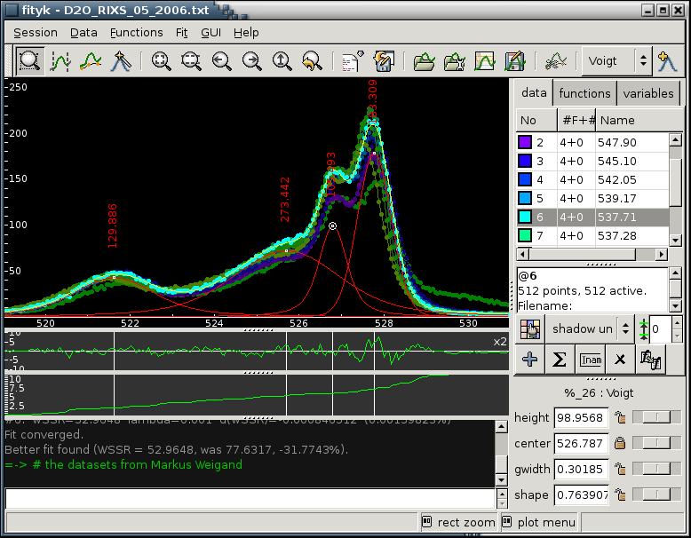

.. title:: Fityk -- peak fitting program -- Screenshots

.. meta::
   :description: Fityk screenshots. Windows, Mac OS X and Linux.
   :keywords: peak fitting, curve fitting

.. image:: fityk-banner.png
   :align: center
   :target: http://fityk.nieto.pl

Screenshots
===========

Mac OS X
--------

.. figure:: screenshots/fityk-1.0.1-osx-full.png
   :align: center
   :scale: 80

   Southern Oscillation Index.

.. figure:: screenshots/fityk-1.0.1-osx-zn.png
   :align: center

   Powder diffraction data.

MS Windows
----------

.. figure:: screenshots/fityk-1.0.1-win-err.png
   :align: center

   Test data *Gauss3* from NIST StRD.

.. figure:: screenshots/fityk-1.0.1-win-prefs.png
   :scale: 90
   :align: center

   The main plot configuration dialog.

.. figure:: screenshots/fityk-1.0.1-win-udf.png
   :align: center

   User-defined function. Log-log plot.

Linux
-----

.. figure:: screenshots/fityk-1.0.1-gtk-multi.png
   :scale: 90
   :align: center

   Data series.

Older versions
--------------

.. figure:: screenshots/lammps2.png
   :align: center

   Statistics from molecular dynamics simulation.

   Data series.

.. raw:: html

   

